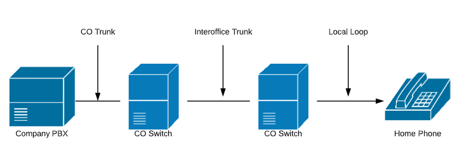
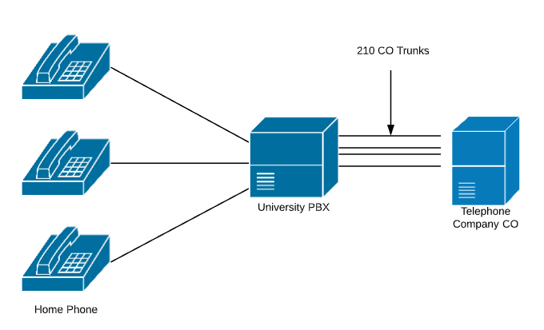

# Notes 1
## High Level Time Line Overview of Telecommunications Technology
|Year|Description|
|----------------|-------------------------------|
|1950's - 1960's | Microwave line of sight links for transmitting long distance telephone calls using analog modulation with frequency division multiplexing (very noisy)|
|1960's|Introduction of DS1/T1 (time division multiplexing) carrier systems carrying digital voice signals, converted from analog using non-linear pulse code modulation|
|1970's|- Introduction of linear predictive codecs to reduce digital bandwidth requirements (continued on going improvements based on advances in digital processing) - 1st Generation Multimode fiber optic cable introduced 45 Mb/s-140Mb/s bandwidth|
|1980's|- 1st Cellular Phones (Analog System) - 2nd Generation Singlemode fiber optic cable 1.7 Gb/s bandwidth repeater spacing 50 km|
|1981| IPv4 Standard RFC 791|
|1981| Commercial Introduction of 10Mb/s Ethernet|
|1985| IEEE 802.3 CSMA/CD (Based on coaxial cable)|
|1985| Code-Excited Prediction (CELP) a type of LPC|
|1990's|- 2nd Generation Digital Cellular System - 3rd Generation 1.55 $\mu$m lasers and dispersion shifted fiber 2.5 Gb/s repeater spacing 100 km - Late 1990's Development of H.323 and Session Initiation Protocol Standards for VoIP Signaling|
|1995|100BASE-TX Ethernet|
|1999|1000BASE-T Ethernet|
|2000's|- 4th Generation Optical Amplification (erbium-doped fiber amplifier) and wavelength-division multiplexing 14Tb/s bandwidth over single fiber 60 km line - Development and Implementation of Synchronous Optical Networking (SONET) Framing Structure to carry ATM cells, IP Packets, and Ethernet frames OC-1 51 Mb/s, OC-3 155 Mb/s, OC-12 622Mb/s, OC-192 10Gb/s, OC-768 40Gb/s|
|2004|Commercial VoIP Service Providers Proliferate|
|2006|10GBase-T Ethernet|
|2020|Deployment of 5G Cellular up to using multiple frequencies for bandwidth improvement and lower latency up to 10 Gbp/s|

 

---
---

## Historical Overview
### Public Switched Telephone Network (PSTN)

 Components of a Telephony Network

|Abreviation|Description|
|-|-|
|CO|Central Office|
|PBX|Private Branch Exchange|

 University Telephone System

#### Three Categories of Signaling
- Supervisory signaling
- Address signaling
- Information signaling
---
#### Supervisory Signaling
- Loop Start Signaling
  - Phone goes off-hook **-48** volts DC between tip and ring, current starts to flow
- Ground Start Signaling
  - Ring Lead goes to ground
- Ringing
  - **75** volts AC sent to destination phone from telephone switch
---
#### Address Signaling
- Pulse Dialing (old rotary phones)
- Dual Tone Multifrequency (DTMF). Introduced commerically in 1963

|Frequency|1209 Hz|1336 Hz|1477 Hz|
|-|-|-|-|
|**697 Hz**|1|2|3|
|**770 Hz**|4|5|6|
|**852 Hz**|7|8|9|
|**941 Hz**|*|0|#|
---
#### Information Signaling
|Information Signal|Description|Frequencies (Hz)|
|-|-|-|
|**Dial Tone**|Heard by caller after picking up the handset|350 and 400|
|**Ring Back**|Heard by caller, indicating that the called phone is ringing|440 and 480|
|**Busy Signal**|Heard by the caller, indicating that the called phone is off-hook|480 and 620|
|**Reorder tone**|Heard by the caller, indicating that the call cannot be completed|480 and 620|

### VoIP Components

 VoIP Components

- IP Phones - Have an Ethernet network connection used to send an receive calls.
- Call agents - Many features to manage VoIP network Cisco CallManager (CCM).
- Gateways - Forward calls between different types of networks. Call from a VoIP phone to home phone via the PSTN.
- Gatekeepers - Monitor/Manage available bandwidth on WAN.
- Multipoint Control Units (MCUs) - Used in processing conference calls.
- Voice-enabled Ethernet switches - Provide QoS configuration features. When VoIP phone is detected provide power over Ethernet (POE). Provide VLAN features to separate voice and data.
