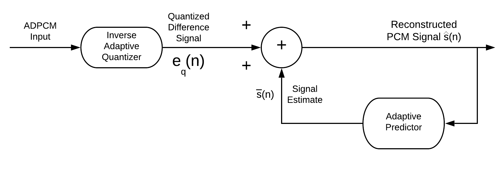
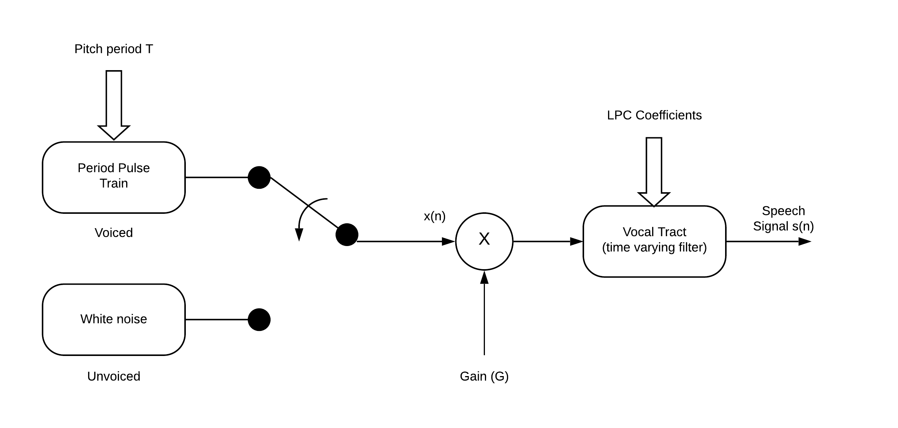
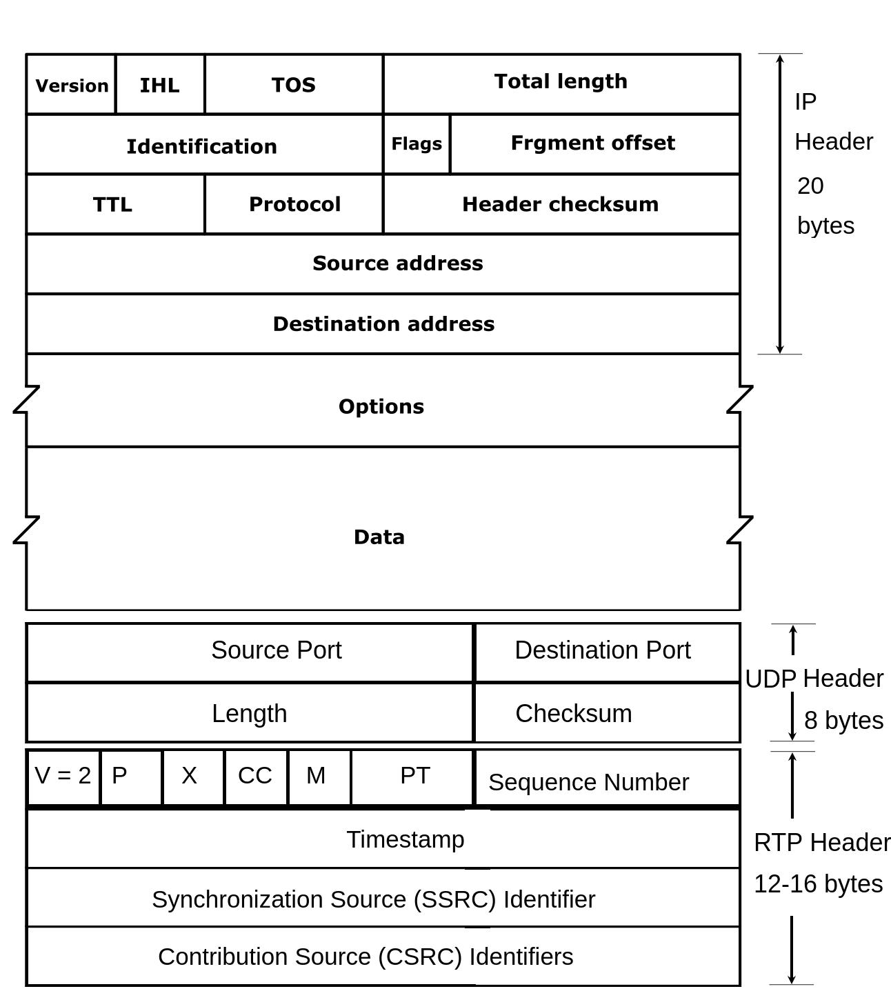

# Notes 2

## Speech Compression Basics 1

---

### Speech Compression Basics

Speech has two basic components:

1. Amplitude
2. Frequency content

To get a good representation of narrow band human voice the frequency range is approximately 300 - 3400 Hz. This is simplified to 0 - 4000 Hz.

**Q. What would be the sampling rate to avoid aliasing as required by the Nyquist Theorem?**
 _Ans. 8000 samples/sec_

The reason for the Nyquist criterion is to prevent a false or alias representation of the sampled waveform

**Aliasing**

 _An insufficient number of samples of the original waveform can result in a false or alias waveform_

---

The initial process of sampling in called \*pulse amplitude modulation **(PAM)\*** [see figure below]
 
 _Sampling_

---

 Quantization and Coding

One then assigns a bit number representing the magnitude of the waveform. This is called _quantization_. If linear is used the lower amplitude waveforms will have a great quantization error creating greater distortion in the lower amplitude (or volume) waveforms

### Linear Quantization

---

### Speech

Approximate Probability Density Function of Speech 

 Speech has a much higher probability density function (PDF) for lower level signals than for higher level signals. Therefore, to improve the signal to noise ratio when the signal is coded and then decoded back to an analog signal a non-uniform quantization scheme is utilized illustrated in the following figure:

### Logarithmic Quantization

- A sample is taken every 1/8000th of a second.
- Each _segment_ is divided into steps.
- Using a logarithmic scale, more accurate samples are taken at lower volumes.

Two logarithmic coding schemes are used. That used in the United States and Japan is called the $\mu$-law. Other countries use the A-law coding scheme.

The $\mu$-law is represented by the following equation:

$Y=sgn(x)*\frac{ln(1+\mu|x|)}{ln(1+\mu)}$

 $x$ is the sampled input voltage scaled as shown below:
 Where $\mu = 255$ and $x = \frac{v}{Vmax}$

In actual practice the initial waveform is sampled and coded using a uniform 16 bit quantization and then compressed through the $\mu$-law (or A-law) to an 8 bit quantization. The 8 bit quantization consists of the following pattern:

| P   | Seg | Seg | Seg | Step | Step | Step | Step |
| --- | --- | --- | --- | ---- | ---- | ---- | ---- |

                        1 Polarity bit, 3 Segment bits, 4 step bits

---

### Speech Waveform and Spectrum

There are two components to speech:

1. "Voiced sounds" such as when you say a vowel like **a, e, i**
2. "Unvoiced sounds" such as **s** and **sh**
   The waveforms and spectrums are substantially different. There is a patter to voiced speech as shown in the two figures below.

 _Sample of voiced speech - waveform and spectrum_

The "unvoiced" speech shown in the figure is much more random and "noise like".

 _Sample of unvoiced speech - waveform and spectrum_

---

### Speech Compression and coding techniques

There are three general compression techniques, waveform-based, parametric-based, and hybrid coding

1. Waveform based
   - Mainly to remove redundancy in the speech waveform and reconstruct the waveform at the decoder side.
   - Simple and low in implementation complexity
   - Compression ratios are low
   - Typical bit range from 64 kb/s to 16 kb/s
   - Typical waveform-based speech codecs are PCM G.711
   - ADPCM (ADaptive Differential PCM) G.726 uses difference signal rather than encoding entire sample.

---

In the ADPCM, the adaptive predictor will predict or estimate the current speech signal based on previously received $N$ speech samples $\bar{s}(n)$ where
$\hat{s}(n) = \Big[\sum_{i=1}^N a_i(n) \bar{s} (n-i) \Big]$ where
$a_1, i = 1\cdots N$ are the estimated predictor coefficients. The difference signal $e(n)$ is the prediction error. It is the difference between the speech signal $s(n)$ and the signal estimate $\hat{s}(n)$. The difference between $e(n)$ and $e_q(n)$ is the quantization error.

---

 
_Encoder_

 
_Decoder_

 _Block Diagram for ADPCM Codec_

2. Parametric based
   - Based on how speech is produced.
   - Assumes the speech signal is stationary or the shape of the vocal tract is stable for short periods of time (e.g. 20 msec).
   - Sends only relevant parameters for application to the speech reproduction model to the receiver.
   - High compression ratios can be achieved.
   - Normally operates in bit rates from 4.8 to 1.2 kb/s.
   - Speech sound is more mechanical based on a simple Linear Predictive Coding (LPC) model _(see the associated figures)_

 
_Speech generation mathematical model_

 
_The LPC Model_

3. Hybrid Compression Coding - Analysis-by-Synthesis
   - Find the best match excitation signal which results in the minimum error between the original and synthesized speech signal.
   - Combines the features of both waveform and parametric coding - Analysis-by-Synthesis (AbS).
   - Code-Excitation Linear Prediction (CELP) uses an indexed lookup to match the code of the best waveform excitation signal to be applied to the LPC process for speech reproduction.
   - Bit rates from 16 kb/s to 4.8 kb/s.
   - Conjugate Structure Algebraic Code Excited Linear Prediction (CS-ACELP) G.729 uses look ahead buffer to see whether next sample matches pattern already in cookbook. If it does only index is sent instead of actual sample.
   - Low-Delay Conjugate Excited Linear Prediction (LDCELP) uses smaller codebook more bandwidth 16 kb/s G.728.
   - Mean Opinion Score (MOS) $4 - 3.5$ (PCM G.711 4.1)

## Codec Summary

Summary of NB, WB, SWB and FB speech codecs

| Codec               | Standard Body/Year | Type             | NB or WB or FB | Bit rate (kb/s) | Speech frame(ms) | Bits per sample/frame | Look-ahead (ms) | Algorithm delay (ms) |
| ------------------- | ------------------ | ---------------- | -------------- | --------------- | ---------------- | --------------------- | --------------- | -------------------- |
| G.711               | ITU/1972           | PCM              | NB             | 64              | 0.125            | 8                     | 0               | 0.125                |
| G.726               | ITU/1990           | ADPCM            | NB             | 40              | 0.125            | 5                     | 0               | 0.125                |
|                     |                    |                  |                | 32              |                  | 4                     |                 |
|                     |                    |                  |                | 24              |                  | 3                     |                 |
|                     |                    |                  |                | 16              |                  | 2                     |                 |
| G.728               | ITU/1992           | LD-CELP          | NB             | 16              | 0.625            | 10                    | 0               | 0.625                |
| G.729               | ITU/1996           | CS-ACELP         | NB             | 8               | 10               | 80                    | 5               | 15                   |
| G.723.1             | ITU/1996           | ACELP            | NB             | 5.3             | 30               | 159                   | 7.5             | 37.5                 |
|                     |                    | MP-MLQ           | NB             | 6.3             |                  | 189                   |                 |
| GSM                 | ETSI/1991          | (FR)RPE-LTP      | NB             | 13              | 20               | 260                   | 0               | 20                   |
|                     | ETSI/1999          | (HR)VSELP        | NB             | 5.6             |                  | 112                   | 0               | 20                   |
|                     | ETSI/2000          | (EFR)ACELP       | NB             | 12.2            |                  | 244                   | 0               | 20                   |
| AMR                 | ETSI/2000          | ACELP            | NB             | 4.75            | 20               | 95                    | 5               | 25                   |
|                     |                    |                  |                | 5.15            |                  | 103                   |                 |                      |
|                     |                    |                  |                | 5.9             |                  | 118                   |                 |                      |
|                     |                    |                  |                | 6.7             |                  | 134                   |                 |                      |
|                     |                    |                  |                | 7.4             |                  | 148                   |                 |                      |
|                     |                    |                  |                | 7.95            |                  | 159                   |                 |                      |
|                     |                    |                  |                | 10.2            |                  | 204                   |                 |                      |
|                     |                    |                  |                | 12.2            |                  | 244                   |                 |                      |
| iBLC                | IETF/2004          | CELP             | NB             | 15.2            | 20               | 304                   | 0               | 20                   |
|                     |                    |                  |                | 13.33           | 30               | 400                   |                 | 30                   |
| G.711.1             | ITU/2008           | PCM-WB (MDCT) | NB/WB          | 64              | 5                | 320                   | 5               | 11.875               |
|                     |                    |                  |                | 80              |                  | 400                   |                 |                      |
|                     |                    |                  |                | 96              |                  | 480                   |                 |                      |
| G.722               | ITU/1988           | SB-ADPCM         | WB             | 64              | 0.125            | 8                     | 0               | 0.125                |
|                     |                    |                  |                | 56              |                  | 7                     |                 |                      |
|                     |                    |                  |                | 48              |                  | 6                     |                 |                      |
| G.722.1             | ITU/1999           | Transform Coding | WB             | 24              | 0.125            | 8                     | 0               | 0.125                |
|                     |                    |                  |                | 32              |                  | 640                   |                 |                      |
|                     | ITU/2005           |                  | SWB            | 24/32/48        |                  | 480-960               |                 |                      |
| G.719               | ITU/2008           | Transform Coding | FB             | 32-128          | 20               | 640-2560              | 20              | 40                   |
| AMR-WB (G.722.2) | ETSI/ITU/2003      | ACELP            | WB             | 6.6-23.85       | 20               | 132-477               | 0               | 20                   |
| SILK                | IETF/2009          | CELP             | WB             | 6-40            | 20               | 120-800               | 0               | 20                   |

### Legend

| Abbreviation           | Description                                                                                                                                                      |
| ---------------------- | ---------------------------------------------------------------------------------------------------------------------------------------------------------------- |
| NB                     | Narrowband = 0 - 4kHz                                                                                                                                            |
| WB                     | Wideband = 0 – 7kHz high fidelity speech general audio frequency range                                                                                           |
| SWB                    | Super-Wideband = 50 – 14kHz                                                                                                                                      |
| FB                     | Fullband = 20 – 20kHz to provide high quality, efficient compression for speech music and general audio. Used in teleconferencing and tele-presence applications |
| ITU                    | International Telecommunications Union                                                                                                                           |
| ETSI                   | European Telecommunication Standards Institute                                                                                                                   |
| IETF                   | Internet Engineering Task Force                                                                                                                                  |
| PCM                    | Pulse Code Modulation                                                                                                                                            |
| ADPCM                  | Adaptive Differential Pulse Code Modulation                                                                                                                      |
| LD-CELP                | Low-delay Code Excited Linear Prediction uses analysis-by-synthesis approach for codebook search                                                                 |
| CS-ACELP               | Conjugate Structure-Algebraic Code Excited Linear Prediction                                                                                                     |
| MP-MLQ/ACELP           | Multi Pulse—Maximum Likelihood Quantization                                                                                                                      |
| GSM                    | Global System for Mobile Communications                                                                                                                          |
| (FR) Full Rate RPE-LTP | Regular Pulse Excitation/Long Term Prediction Linear prediction coder                                                                                            |
| (HR) VSELP             | Half Rate Vector-Sum Excited Linear Prediction                                                                                                                   |
| (EFR) ACELP            | Enhanced Full Rate ACELP                                                                                                                                         |
| AMR                    | Adaptive Multi Rate Used in wireless communications (3G)                                                                                                         |
| iLBC                   | Internet Low Bit Rate Codec robust tolerance to packet loss used in Google Talk and Yahoo Messenger                                                              |
| SILK                   | Super Wideband Audio Codec used in Skype                                                                                                                         |

---

---

### Summary of NB, WB, SWB, and FB speech/audio compression coding

| Mode                 | Signal Bandwidth (Hz) | Sampling rate (kHz) | Bit-rate(kb/s) | Examples                         |
| -------------------- | --------------------- | ------------------- | -------------- | -------------------------------- |
| Narrowband (NB)      | 300 - 3400            | 8                   | 2.4 - 64       | G.711, G.729, G.723, AMR, LPC-10 |
| Wideband (WB)        | 50 - 7000             | 16                  | 6.6 - 96       | G.711.1, G.722, G.722.1, G.722.2 |
| Super-wideband (SWB) | 50 - 14000            | 32                  | 24 - 48        | G.722.1 (Annex C)                |
| Fullband (FB)        | 20 - 20000            | 48                  | 32 - 128       | G.719                            |

### Things to think about regarding Codecs

1. **Determine the input and output data rates for a G.711 codec given that the sample rate is 8kHz and the sample is converted to a 14-bit linear code before being compressed into non-linear PCM.**

   Ans:

   - Input data rate $= 8000$ samples/sec \* $14$ bits/sample $= 112$ kb/s
   - Output data rate $= 8000$ samples/sec \* $8$ bits/sample $= 64$ kb/s

   The compression ratio is $\frac{112}{64}$ $= 1.75$

2) **The G.726 codec is based on ADPCM (Adaptive Differential PCM). Assume the codec’s input speech signal is 16-bit linear PCM with a sampling rate of 8 kHz. The output of the G.726 can operate at four possible data rates; 40kb/s, 32kb/s, 24kb/s and 16 kb/s. How are these data rates obtained?**

   Ans: For the ADPCM encoder, only the difference signal between the input PCM linear signal and the predicted signal is quantized and coded. The difference signal has a much smaller dynamic range than the input to the PCM speech signal so fewer quantization levels are needed.

   - Assume that the number of bits needed to code each quantized difference signal is x,
   - For $40$ kb/s  
      => $40$ kb/s = $8000$ samples/sec $*$ bits/sample
      => $X = 40*$$\frac{1000}{8000}$ $= 5$ bits/sample

   - For $32$ kb/s  
      => $32$ kb/s = $8000$ samples/sec $*$ bits/sample
      => $X = 32*$$\frac{1000}{8000}$ $= 4$ bits/sample

   - For $24$ kb/s  
      => $24$ kb/s = $8000$ samples/sec $*$ bits/sample
      => $X = 24*$$\frac{1000}{8000}$ $= 3$ bits/sample

   - For $16$ kb/s  
      => $16$ kb/s = $8000$ samples/sec $*$ bits/sample
      => $X = 16*$$\frac{1000}{8000}$ $= 2$ bits/sample

   For compression ratios when compared to standard PCM at $64$ kb/s

   - $\frac{64}{40}$ $= 1.6$
   - $\frac{64}{32}$ $= 2$
   - $\frac{64}{24}$ $= 2.67$
   - $\frac{64}{16}$ $= 4$

---

---

3. **The G.723.1 codec transmission rates can operate at 5.3(ACELP Algebraic-Code-Excited Linear Predication) or 6.3 kb/s (MPMLQ Multi-Pulse—Maximum Likelihood Quantization)**

   1. What is the frame size?

      - $30$ ms

   2. How many samples are in each frame?

      - G.723.1 is a narrow band code so the sampling rate would be $8000$ samples/sec
      - $8000$ samples/sec $*$ $30$ ms $= 240$ samples

   3. What is the number of parameter bits encoded in each frame for the operating bit rates?
      - For bit rate $5.3$ kb/s
        - $30 ms * 5.3 kb/s = 159 bits$
      - For bit rate $6.3$ kb/s
        - $30 ms * 6.3 kb/s = 189 bits$

---

---

4. **In a Voip system an 8 kb/s G.729 is applied. The packet size can be configured to include one G.729 speech frame per packet or two G.729 speech frames per packet. What is the G.729 payload size, required G.729 IP bandwidth and bandwidth efficiency in each case.**

   - For $8 kb/s$ G.729 codec, the length of a speech frame is 10ms, the codec bits for a 10ms frame is then $8 kb/s * 10ms = 80 bits$ or $10 bytes$.
   - If one packet includes one speech frame the payload is 10 bytes. If a packet includes 2 speech frames the payload is 20 bytes.

   The required IP bandwidth for two frames one packet case is:
    $\frac{(20 + 40) * 8bits/byte}{20ms}$ = 24 kb/s

   - The bandwidth efficiency is: $\frac{20}{20+40}$ = 0.33 or 33%

    The required IP bandwidth for one frame one packet (where the IP/UDP/RTP header is 40 bytes, IP 20 bytes, UDP 8 bytes, RTP 12 bytes):
     $\frac{(10 + 40) * 8bits/byte}{10ms}$ = 40 kb/s
    - The bandwidth efficiency is: $\frac{10}{10+40}$ = 0.2 or 20%

---

---

## Packetizing and Transport of encoded Audio and Video

### Transport Control Protocol (TCP):

It is unsuitable for the transport of real-time applications such as voice and video over the network. The complex overhead associated with reliable in sequence packet delivery mechanisms are unsuitable for real-time processes.

### User Datagram protocol (UDP)

It is the more suitable option. It has small header overhead but has no way of determining if packets have been lost or arriving out of sequence.

### Real-time Transport Protocol—RTP

RTP was originally proposed in RFC 1889 in 1996. Since then it has been refined in RFC 3550 in 2003. It is intended to support the real-time transfer of multimedia data over UDP. RTP added a sequence number and timestamp field which allows the
receiver to process the voice/video packets in the correct order. Real-Time Control protocol (RTCP) is used with RTP to monitor the quality of service of a VoIP session and convey information about the participants in an on-going session. The protocol
stack including the IP and UDP headers with RTP is shown on the following slide.

_
Real Time Transport Header
_

**RTP Header Definitions**

- **V**: This field (2 bits) contains the version of the RTP protocol. The version defined by RFC 1889[10] is two.
- **P**: This is the Padding bit indicating whether there are padding fields in the RTP packet.
- **X**: This is the eXtension bit indicating whether extension header is present.
- **CC**: This field (4 bits) contains the CSRC count, the number of contributing source identifiers.
- **M**: This is the Marker bit. For voice, this marks the start of a voice talkspurt, if silence suppression is enabled at the encoder. For example, M is set to 1 for 1st packet after a silence period and is zero otherwise. For video, te marker bit is set to one (True) for the last packet of the video frame and zero otherwise.
  - For example, if an I-frame is split into 8 packets to transmit over the channel/network, the first seven packets will have the marker bit set to Zero (false) and the 8th packet (last packet for the I-frame) will have the marker bit set to One (True). If a P-frame is put into two packets. The first packet will have the marker bit set to Zero and the second packet's M bit set as One. If there is only one packet for a P or B frame, the marker bit will always be One.
- **Payload Type (PT)**: This field (7 bits) contains the payload type for voice or video codecs, e.g., for PCM-$\mu$ law, the payload type is defined as zero. The payload type for common voice and video codecs are shown in **Tables 4.1** and **4.2**, respectively.
- **Sequence number**: This field (16 bits) contains the sequence number which will be incremented by one for each RTP packet sent for detecting packet loss.
- **Timestamp**: This field (32 bits) indicates the sampling instant when the first octet of the RTP data was generated. It is measured according to media clock rate.
  - _For voice_, the timestamp clock rate is 8 kHz for majority of codecs and 16 kHz for some codecs.
    - For example, for G.723.1 codec with frame size of 30 ms (containing 240 speech samples at 8 kHz sampling rate) and one speech frame per packet, the timestamp difference between two consecutive packets will be 240. In case of speech using G.723.1 codec, the clock rate is the same with the sampling rate and the timestamp difference based in the media clock rate for two consecutive packets can be decided by the number of speech samples which a packet contains.
  - _For video_, the timestamp clock rate is 90 kHz for majority of codecs. The timestamp will be the same on successive packets belonging to a same video frame (e.g. one I-frame was segmented into several IP packets which will have the same timestamp values in their RTP headers). If a video encoder uses the constant frame rate, _for example_ 30 frames per second, the timestamp difference between two consecutive packets (belonging to different video frames) will have the same value of 3000 ($\frac{90,000}{30}$ $= 3000$), or the media clock difference between two consecutive packets is 3000. If frame rate is reduced to half (e.g. 15 frames per second), the timestamp increment will be doubled (e.g. 6000).
  - SSRC identifier: SSRC is for Synchronization Source. This field (32 bits) contains the identifier for a voice or video source. Packets originated from the same source will have the same SSRC number.
  - CSRC identifier: CSRC stands for Contribution Source. It will only be available when the CC field value is nonzero which means more than one source have been mixed to produce this packet's contents. This field (32 bits) contains an entry for the identifier of a contributing source. Maximum 16 entries can be supported.
  - Payload Type: This field (7 bits) contains the payload type for voice or video codecs, e.g. for PCM $\mu$-law, the payload type is defined as zero. The payload type for common voice and video codecs are shown in the tables below:

| PT  | Codec | Media Type | ms/frame | Default ms/packet | Clock rate(Hz) |
| --- | ----- | ---------- | -------- | ----------------- | -------------- |
| 0   | PCMU  | A          |          | 20                | 8,000          |
| 3   | GSM   | A          | 20       | 20                | 8,000          |
| 4   | G.723 | A          | 30       | 30                | 8,000          |
| 7   | LPC   | A          |          |                   | 8,000          |
| 8   | PCMA  | A          |          | 20                | 8,000          |
| 9   | G.722 | A          |          | 20                | 8,000          |
| 18  | G.729 | A          | 10       | 20                | 8,000          |

---

> Payload efficiencies in Ethernet frames
> Ethernet frame with IP/UDP/RTP headers and RTP payload for G.711
> |Ethernet header|IP header|UDP header|RTP header|RTP payload|
> |-|-|-|-|-|
> |14 bytes|20 bytes|8 bytes|12 bytes|Payload length (e.g. 160 bytes)|
>
> For a PCM stream the required bandwidth is 64kb/s
> (160bytes x 8 bits/byte)/64kb/s = 20 ms _[1 Ethernet frame every 20 ms]_
>
> The required bandwidth at the IP level is :
> $\frac{(160 + 40) * 8 bits}{20 ms}$ = 80 kb/s
>
> _40 is the IP/UDP/RTP header_
>
> > The bandwidth efficiency at the IP level is:
> > $\frac{Length\ of\ payload\ size}{Length\ of\ Packet\ at\ IP\ level} = \frac{160}{160+40} = 0.8\ or\ 80\%$

> The required bandwidth at the Ethernet level is :
> $\frac{(160 + 54) * 8 bits}{20 ms}$ = 85.6 kb/s
>
> _54 is the Ethernet + IP/UDP/RTP header_
>
> > The bandwidth efficiency at the IP level is:
> > $\frac{Length\ of\ payload\ size}{Length\ of\ Packet\ at\ IP\ level} = \frac{160}{160+54} = 0.75\ or\ 75\%$
