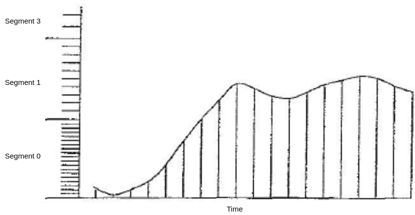
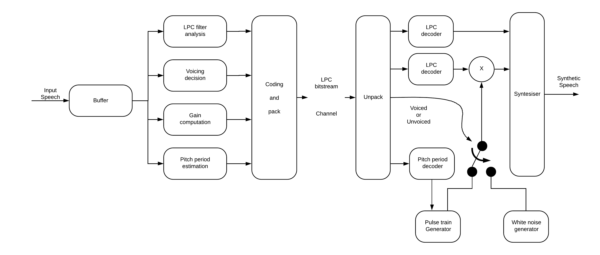

# Notes 2
## Speech Compression Basics 1
---
### Speech Compression Basics
Speech has two basic components:
1. Amplitude
2. Frequency content

To get a good representation of narrow band human voice the frequency range is approximately 300 - 3400 Hz. This is simplified to 0 - 4000 Hz.

**Q. What would be the sampling rate to avoid aliasing as required by the Nyquist Theorem?**
 *Ans. 8000 samples/sec*

The reason for the Nyquist criterion is to prevent a false or alias representation of the sampled waveform

**Aliasing**

 *An insufficient number of samples of the original waveform can result in a false or alias waveform*

---

The initial process of sampling in called *pulse amplitude modulation **(PAM)*** [see figure below]
 
 *Sampling*

---

 Quantization and Coding

One then assigns a bit number representing the magnitude of the waveform. This is called *quantization*. If linear is used the lower amplitude waveforms will have a great quantization error creating greater distortion in the lower amplitude (or volume) waveforms

### Linear Quantization

---

### Speech 
Approximate Probability Density Function of Speech 

 Speech has a much higher probability density function (PDF) for lower level signals than for higher level signals. Therefore, to improve the signal to noise ratio when the signal is coded and then decoded back to an analog signal a non-uniform quantization scheme is utilized illustrated in the following figure:
### Logarithmic Quantization

- A sample is taken every 1/8000th of a second.
- Each *segment* is divided into steps.
- Using a logarithmic scale, more accurate samples are taken at lower volumes.

Two logarithmic coding schemes are used. That used in the United States and Japan is called the $\mu$-law. Other countries use the A-law coding scheme.

The $\mu$-law is represented by the following equation:

$Y = sgn(x)* \frac{ln(1+\mu|x|)}{ln(1+\mu)}$

 $x$ is the sampled input voltage scaled as shown below:
 Where $\mu = 255$ and $x = \frac{v}{Vmax}$

In actual practice the initial waveform is sampled and coded using a uniform 16 bit quantization and then compressed through the $\mu$-law (or A-law) to an 8 bit quantization. The 8 bit quantization consists of the following pattern:

|P|Seg|Seg|Seg|Step|Step|Step|Step|
|-|-|-|-|-|-|-|-|

                        1 Polarity bit, 3 Segment bits, 4 step bits

---

### Speech Waveform and Spectrum
There are two components to speech:
1. "Voiced sounds" such as when you say a vowel like **a, e, i**
2. "Unvoiced sounds" such as **s** and **sh**
The waveforms and spectrums are substantially different. There is a patter to voiced speech as shown in the two figures below.

 *Sample of voiced speech - waveform and spectrum*

The "unvoiced" speech shown in the figure is much more random and "noise like".

 *Sample of unvoiced speech - waveform and spectrum*

---

### Speech Compression and coding techniques
There are three general compression techniques, waveform-based, parametric-based, and hybrid coding 

1. Waveform based
   - Mainly to remove redundancy in the speech waveform and reconstruct the waveform at the decoder side.
   - Simple and low in implementation complexity
   - Compression ratios are low
   - Typical bit range from 64 kb/s to 16 kb/s
   - Typical waveform-based speech codecs are PCM G.711
   - ADPCM (ADaptive Differential PCM) G.726 uses difference signal rather than encoding entire sample.

---
In the ADPCM, the adaptive predictor will predict or estimate the current speech signal based on previously received $N$ speech samples $\bar{s}(n)$ where 
$\hat{s}(n) = \Big[\sum_{i=1}^N a_i(n) \bar{s} (n-i) \Big]$ where
$a_1, i = 1\cdots N$ are the estimated predictor coefficients. The difference signal $e(n)$ is the prediction error. It is the difference between the speech signal $s(n)$ and the signal estimate $\hat{s}(n)$. The difference between $e(n)$ and $e_q(n)$ is the quantization error.

---

 
*Encoder*

 
*Decoder*

 *Block Diagram for ADPCM Codec*

2. Parametric based
   - Based on how speech is produced.
   - Assumes the speech signal is stationary or the shape of the vocal tract is stable for short periods of time (e.g. 20 msec).
   - Sends only relevant parameters for application to the speech reproduction model to the receiver.
   - High compression ratios can be achieved.
   - Normally operates in bit rates from 4.8 to 1.2 kb/s.
   - Speech sound is more mechanical based on a simple Linear Predictive Coding (LPC) model *(see the associated figures)*

 
*Speech generation mathematical model*

 
*The LPC Model*

3. Hybrid Compression Coding - Analysis-by-Synthesis
   - Find the best match excitation signal which results in the minimum error between the original and synthesized speech signal.
   - Combines the features of both waveform and parametric coding - Analysis-by-Synthesis (AbS).
   - Code-Excitation Linear Prediction (CELP) uses an indexed lookup to match the code of the best waveform excitation signal to be applied to the LPC process for speech reproduction.
   - Bit rates from 16 kb/s to 4.8 kb/s.
   - Conjugate Structure Algebraic Code Excited Linear Prediction (CS-ACELP) G.729 uses look ahead buffer to see whether next sample matches pattern already in cookbook. If it does only index is sent instead of actual sample.
   - Low-Delay Conjugate Excited Linear Prediction (LDCELP) uses smaller codebook more bandwidth 16 kb/s G.728.
   - Mean Opinion Score (MOS) $4 - 3.5$ (PCM G.711 4.1)
