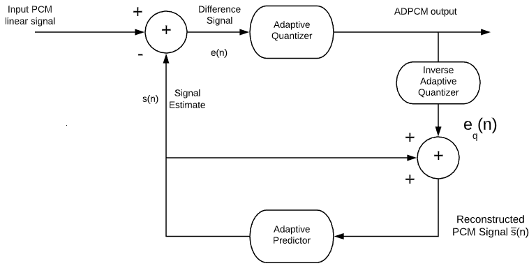

# Exam 1 Review

### Q1. Understand basic concepts of Historical PSTN

> **Ans**:
> [Notes 1 has the answers](./Notes_1.html)

### Q2. Understanding different approaches to digitizing and reproducing a voice signal (PCM, waveform sampling, and Vocoders)

> **Ans**:
>
> - PCM - ??
>
> * Waveform Sampling - : In this approach, the voice signals are sampled and digitized at the encoder. The digitized bit patterns are reproduced to get the analog voice signals at the decoder.

> - Vocoders - A vocoder instead of sending entire bit patterns like wave-form sampling, it sends the parameter lists of synthesized voice to the decoders. The decoders takes the parameter lists of synthesized voice as input and produce analog voice signals as output.
>
>   The vocoders are a simple parametric approach and the refinement to this approach is hybrid compression coding which uses the pitch excitation coefficient of the voice resulting in lesser errors in comparison to original and synthesized voice.
>
>   They produce a model the voice system and produce voice from that.

### Q3. Understand the reason for non-uniform quantization for voice signals

> **Ans**: Because the pdf for low amplitudes is higher in voice signals, non-uniform quantization ($\mu$-law and A-law) is used to increase the accuracy of quantization at low level amplitudes to reduce the distortion produced by quantization error.

### Q4. • Understand the difference in simple vocoders (Parametric-based) and analysis-by-synthesis

> **Ans**: Two vocoder techniques which take advantage of the stationary property of a voice signal over short periods of time:
>
> - The parametric model:
>
>   - Assumes the speech signal is stationary or the shape of the vocal tract is stable for short periods of time (e.g. 20 msec)
>   - Sends only relevant parameters for application to the speech reproduction model to the receiver
>   - High compression ratios can be achieved
>   - Normally operates in bit rates from 4.8 to 1.2 kb/s
>      > 
>
> - Analysis-by-Synthesis (Hybrid Compression Coding):
>   - Find the best match excitation signal which results in the minimum error between the original and synthesized speech signal
>   - Combines the features of both waveform and parametric coding—Analysis-by-Synthesis (AbS)
>   - Code-Excitation Linear Prediction (CELP) uses an indexed lookup to match the code of the best waveform excitation signal to be applied to the LPC process for speech reproduction
>   - Bit rates from 16 kb/s to 4.8 kb/s
>   - Conjugate Structure Algebraic Code Excited Linear Prediction (CS-ACELP) G.729 Uses look ahead buffer to see whether next sample matches pattern already in codebook. If it does only index is sent instead of actual sample
>   - Low-Delay Conjugate Excited Linear Prediction (LDCELP) uses smaller codebook more bandwidth 16 kb/s G.728
>   - Mean Opinion Score (MOS) 4-3.5 (PCM G.711 4.1)
>
> Both of these vocoders use a Linear Predication Coding process to predict the parameters for modeling the signal.

### Q5.Have a general understanding of The role of the IP/UDP/RTP headers in the Packetizing and Transport of Encoded Audio and Video

> **Ans**: Go to <a href='Notes_2_1.html'>Notes 2</a> and scroll down to **RTP headers section**.

### Q6. Understand the basic components of video compression (spatial, temporal, lossey and lossless) and how to calculate required bandwidth using different line formats and YUV formats

> **Ans**:
>
> - Lossy - Lossy compression techniques process the video signal such that the resultant PDF fits the required highly non-uniform requirement. This is achieved by the exploitation of spatial and temporal correlation within and between video frames
>
>   - The system generates a prediction of future frames but only transmits a coded error of the prediction (residual frame) instead of the whole frame
>   - The same prediction is made based on received frames into which the decoded error is added.
>   - This results in a gain of compression ratios not just because fewer coded bits are
>     sent characterizing the residual frame but also the PDF is modified so that lossless compression
>     can be applied with greater effectiveness.
>
> - Lossless - Lossless compression techniques do not introduce any distortion to the original video signal. Therefore an exact copy of the input to the compressor can be recovered at the output.
>
>   - The level of achievable lossless compression is given by the statistical entropy of the video signal H.
>   - Lossless compression is a mechanism of allocating a variable number bits to symbols in such a manner that the bits allocated to more frequently occurring symbols is less than to symbols that occur less frequently
>
> - Spatial Compression - The spatial compression of each frame is done with JPEG, or a modification of it. Each frame is a picture that can be independently compressed.
> - Temporal Compression - In temporal compression, redundant frames are removed. When we watch television, for example, we received 30 frames per second. However, most of the consecutive frames are almost the same. For example, in a static scene in which someone is talking, most frames are the same except for the segment around the speaker’s lips, which changes from one frame to the next.

### Q7. Understand the concept of a wide-sense stationary process particularly as it relates to voice signals

> **Ans:** A process is said to be wide-sense stationary if the mean and the autocorrelation function (first and second order statistics) of the process are time invariant:
> For a segment of N samples of a signal x(m), an estimate of the mean value of the segment is obtained as:
>
> $\hat{\mu} = \frac{1}{N} \sum\limits_{n=0}^{N-1} x(n)$
>
> Correlation is a matching process. The correlation of two signals is a measure of the similarity or dependency of their fluctuations. Autocorrelation refers to the matching of a signal with a delayed version of itself
>
> $R_{xx} (k) = \frac{1}{N} \sum\limits_{n=0}^{N-1} x(n) x(n-k)$
>
> Voice signals are wide-sense stationary for short periods (20-30 ms)

### Matching

| Description                                                                                                                                        | Word for it              |
| -------------------------------------------------------------------------------------------------------------------------------------------------- | ------------------------ |
| Historical Telephone System                                                                                                                        | PSTN                     |
| Video Compression in which only the difference in successive frames is sent to the decoder                                                         | Temporal Compression     |
| Sending only the difference in successive digitized voice samples rather than the full digitized sample                                            | ADPCM                    |
| Video Compression in which the correlation between adjacent pixels is removed in a frame                                                           | Spatial Compression      |
| A voice compression technique which uses a model of the human voice system and sends model parameters to the decoder to reproduce the voice signal | Vocoder                  |
| A voice compression technique which increases the quantization resolution for voice signals in the lower amplitudes                                | Non-Uniform Quantization |
| A random process has mean and autocorrelation that is time invariant                                                                               | Wide-sense stationary    |

---

## **Previous year exam**

---

### Matching

| Description                                                                                                                                  | Word for it       |
| -------------------------------------------------------------------------------------------------------------------------------------------- | ----------------- |
| Protocol that provides call control and signaling with a user agent client and user agent server based on the exchange of HTTP type messages | SIP               |
| Header followed by voice or video codec data payload                                                                                         | RTP               |
| 64k samples/sec 8 bits/sample                                                                                                                | PCM               |
| Compression using correlation between pixels in a video frame                                                                                | Spatial           |
| The human visual system is more sensitive to \_\_\_\_ than \_\_\_\_                                                                          | Color, Luminosity |
| Carries time stamp information and payload type for a real-time data payload                                                                 | RTP               |
| A part of the SIP protocol that exchanges information regarding media attributes such as codec type and media type with a receiver           | SDP               |
| Processes and forwards calls between different types of networks such as a VoIP to PSTN call                                                 | Gateway           |
| Compression technique that sends only the difference in successive frames                                                                    | Temporal          |
| A vocoder uses this process for coefficient calculations                                                                                     | LPC               |
| Protocol used by RTP with source and destination port numbers                                                                                | UDP               |

### Q1. The mean square distortion is given by

**$D = \int_{-\infty}^{+\infty} [x-f_q (x)]^2 p(x)dx$**

**Where**

**$[x-f_q (x)]^2 p(x)dx$** **is the quantization error squared and p(x) is the probability density function (pdf).**

**For the 3 probability density functions (a, b, c) p(x) is as shown below. Briefly describe why and where approximately non-uniform quantization should be applied if applicable.**

c.

**Ans:** Speech has a higher probability density function at lower level signals than for higher level signals. To increase the signal to noise (SNR) ratio when the signals are coded and decoded back in order to get analog voice signals then the non-uniform quantization is applicable.

a. The increased granularity 'y' of a sampled **x** value occurs to reduce the mean square distortion at higher pdf i.e. the probability density function has the higher value increasing the granularity which reduces the distortion that is around **1, 4**

- $D$ is directly proportional to p(x)
- The pdf is at 1,4

b. The increased granularity occurs to reduce the mean square distortion at higher probability density function.

- The pdf is at 0.

c. Linear quantization is applied. The probability density function is at 1.
